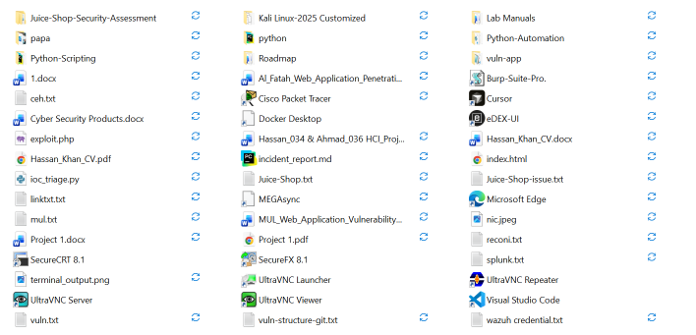
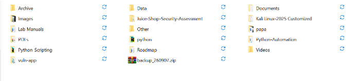

# 📁 Smart File Manager & Backup System


---

## Project Overview

The Smart File Manager & Backup System is a Python-based automation tool designed to eliminate the headache of messy, unorganized folders.

Instead of spending hours manually sorting files into folders, the tool automatically identifies file types, creates appropriate folders, moves files to their correct locations, creates a secure ZIP backup, and generates a detailed summary report.

This project simulates a real-world freelance automation workflow that can save clients hours of manual file management.

---

## Project Objectives

The main objectives of this project are:

- Automate file organization and categorization.
- Detect file types based on extensions.
- Sort files into logical folders (Images, PDFs, Documents, Data, etc.).
- Create automatic ZIP backups before reorganization.
- Generate detailed summary reports for clients.
- Log all activities for audit and debugging.
- Reduce manual file management time by 90% or more.
- Build practical Python skills for freelance automation.
- Solve real-world business problems.

---

## Features

### Core Features
- Auto-Categorization - Sorts files into folders (Images, PDFs, Documents, Data, Videos, Archives)
- Smart Organization - Creates folders automatically if they don't exist
- ZIP Backup - Creates timestamped backups of all files before moving
- Summary Report - Generates detailed text report of all actions
- Logging System - Tracks every action for audit purposes

### Advanced Features
- Error Handling - Graceful handling of missing files and folders
- Detailed Logging - Complete record of all operations
- One-Click Run - Simple input for folder path
- Safe Backup - Creates backup before any file movement
- Statistics - Shows count of files organized by category
- File Type Detection - Supports 20+ file extensions
- Fast Processing - Handles thousands of files quickly

---

## Project Architecture

```
Target Folder (e.g., Downloads)
            |
            v
    Scan All Files
            |
            v
    Detect File Type
            |
            v
    Create Category Folders
            |
            v
    Move Files to Folders
            |
            v
    Create ZIP Backup
            |
            v
    Generate Summary Report
            |
            v
    Client-Ready Output
```

### Folder Structure After Organization

```
target_folder/
|-- Images/          (JPG, PNG, GIF, etc.)
|-- PDFs/            (All PDF files)
|-- Documents/       (TXT, DOCX, DOC, RTF)
|-- Data/            (CSV, XLSX, XLS, JSON)
|-- Videos/          (MP4, AVI, MOV, MKV)
|-- Archive/         (ZIP, RAR, 7Z)
|-- Other/           (Uncategorized files)
|-- backup_YYMMDD.zip (ZIP backup)
|-- Summary_Report.txt (Organization summary)
|-- Organiser.log    (Activity log)
```

---

## Technologies Used

| Technology | Purpose |
|------------|---------|
| Python 3.6+ | Core programming language |
| os | File system operations |
| shutil | Copy, move, and delete files |
| glob | File pattern matching |
| zipfile | ZIP archive creation |
| logging | Activity logging |
| datetime | Date-based backup naming |

### No External Dependencies

This project uses ONLY Python's built-in libraries - no installation required.

```python
import os
import shutil
import glob
import logging
import zipfile
import datetime
```

---

## Project Structure

```
python-automation/
|-- project-1-file-organizer/
|   |-- README.md
|   |-- requirements.txt
|   |-- .gitignore
|   |-- src/
|   |   |-- file_organizer.py
|   |-- docs/
|   |   |-- screenshots/
|   |       |-- before_organization.png
|   |       |-- after_organization.png
|   |-- examples/
|       |-- example_output/
|           |-- Summary_Report.txt
|           |-- Organiser.log
|-- README.md
```

---

## Requirements

- Python 3.6 or higher
- Operating System: Windows, Linux, or Mac
- No external Python packages required

The project uses Python's built-in libraries only:

```
os
shutil
glob
logging
zipfile
datetime
```

---

## Installation

### 1. Clone the Repository

```bash
git clone https://github.com/hassankhan-34/python-automation.git
```

### 2. Navigate to the Project Directory

```bash
cd python-automation/project-1-file-organizer
```

### 3. Verify Python Installation

```bash
python --version
```

Example Output:
```
Python 3.12.x
```

### 4. No Installation Required

Since this uses only built-in libraries, you're ready to go.

---

## Usage

### Quick Start

```bash
# Run the script
python src/file_organizer.py
```

### Organize a Specific Folder

```bash
# When prompted, enter the folder path
Enter folder path to organize (press enter for downloads): C:/Users/YourName/Downloads
```

### Organize Downloads Folder (Default)

```bash
# Just press Enter when prompted
Enter folder path to organize (press enter for downloads): [PRESS ENTER]
```

### Run on a Test Folder

```bash
# First, create a test folder with sample files
python src/file_organizer.py
# Then enter: C:/Users/YourName/Desktop/test_folder
```

The application will:

1. Scan the target folder for all files.
2. Create category folders (Images, PDFs, Documents, Data, etc.).
3. Move each file to its appropriate folder.
4. Create a timestamped ZIP backup.
5. Generate a summary report.
6. Display final statistics.

---

## Example Input

### Before Organization

Target folder contains:

```
Downloads/
|-- photo1.jpg
|-- photo2.png
|-- report.pdf
|-- invoice.pdf
|-- notes.txt
|-- todo.txt
|-- data.csv
|-- sales.xlsx
|-- video.mp4
|-- movie.avi
|-- archive.zip
|-- unknown.xyz
```

### User Input

```
Enter folder path to organize (press enter for downloads): C:/Users/User/Downloads
```

---

## Example Output

### Console Output

```
Smart File Manager & Backup System
========================================

Step1: Creating Folders...
Created Folder: Images
Created Folder: PDFs
Created Folder: Documents
Created Folder: Data
Created Folder: Videos
Created Folder: Archive
Created Folder: Other

Step2: Organizing files...
Found 12 files to organise....

photo1.jpg -> Images/
photo2.png -> Images/
report.pdf -> PDFs/
invoice.pdf -> PDFs/
notes.txt -> Documents/
todo.txt -> Documents/
data.csv -> Data/
sales.xlsx -> Data/
video.mp4 -> Videos/
movie.avi -> Videos/
archive.zip -> Archive/
unknown.xyz -> Other/

Step3: Creating Backup...
Creating Backup: backup_260907.zip
Backup Created: backup_260907.zip (15.23 MB)

Step4: Generating Report...
Report Saved: Summary_Report.txt

==================================================
ORGANIZATION COMPLETE!
==================================================

Summary:
Images: 2 files
PDFs: 2 files
Documents: 2 files
Data: 2 files
Videos: 2 files
Archive: 1 files
Other: 1 files

Total files organized: 12
Backup: backup_260907.zip (15.23 MB)
Report: Summary_Report.txt

==================================================

Done! Check your folder for the organized files.
```

### After Organization

```
Downloads/
|-- Images/
|   |-- photo1.jpg
|   |-- photo2.png
|-- PDFs/
|   |-- report.pdf
|   |-- invoice.pdf
|-- Documents/
|   |-- notes.txt
|   |-- todo.txt
|-- Data/
|   |-- data.csv
|   |-- sales.xlsx
|-- Videos/
|   |-- video.mp4
|   |-- movie.avi
|-- Archive/
|   |-- archive.zip
|-- Other/
|   |-- unknown.xyz
|-- backup_260907.zip
|-- Summary_Report.txt
|-- Organiser.log
```

---

## Freelance Use Case

In a real freelance scenario, this tool solves common client problems.

### Problem Example

> Client: "My Downloads folder has thousands of files. I spend hours every week trying to find documents. Can you help?"

### Solution

The Smart File Manager:
1. Organizes thousands of files in minutes
2. Creates a backup for safety
3. Provides a report of what was organized
4. Logs all actions for accountability

### Client Benefits

| Problem | Solution |
|---------|----------|
| Hours of manual sorting | 90% time saved |
| Lost files | Files organized by type |
| No backups | Automatic ZIP backup created |
| No documentation | Detailed summary report |

### Pricing Value

- Time Saved: 5+ hours per week
- Client Value: $100-$200+ per project
- Reusability: One script, unlimited clients

---

## Error Handling

The script handles common problems gracefully.

### Folder Not Found

```
Enter folder path to organize: C:/fake/path
Error: Folder 'C:/fake/path' does not exist!
```

### Permission Denied

```
Error: Permission denied accessing folder
Try running as administrator (Windows) or with sudo (Linux/Mac)
```

### No Files Found

```
Found 0 files to organise....
No Files To Organize!
```

### Invalid File Types

```
unknown.xyz -> Other/
File moved to 'Other' folder for manual review
```

---

## Security Considerations

This project is designed for legitimate file management.

- Safe Backups - Always creates backup before moving files
- Non-Destructive - Files are moved, not deleted
- Error Recovery - Graceful handling of all errors
- Audit Trail - Complete logging of all actions
- Client Verification - Summary report shows all actions

### Important Notes

- Always test on a sample folder first
- Never run on system folders (C:/Windows, /etc, etc.)
- Backup your data before running
- Only organize folders you own

### What NOT to Do

```
Do not run on System folders
Do not organize folders you don't own
Do not ignore warnings about missing folders
Do not run without verifying the folder path
```

---

## Skills Demonstrated

This project demonstrates practical Automation Developer skills.

| Skill | How Demonstrated |
|-------|------------------|
| Python Programming | Clean, documented Python code |
| File I/O Operations | Reading, moving, copying files |
| File Type Detection | Identifying files by extension |
| Backup Systems | Creating ZIP archives |
| Logging Systems | Professional activity logging |
| Error Handling | Graceful error management |
| Data Processing | Processing multiple files |
| Report Generation | Creating summary reports |
| User Experience | Clear console output and prompts |
| Code Organization | Modular function structure |

---

## Learning Outcome

After completing this project, I can:

- Automate file organization tasks.
- Categorize files based on type.
- Create automatic backup systems.
- Generate professional summary reports.
- Implement logging for audit trails.
- Handle errors gracefully.
- Create client-ready automation scripts.
- Solve real-world business problems.
- Build Python scripts with no external dependencies.
- Structure code for freelance portfolio projects.

---

## Future Improvements

Future versions of this project may include.

### Enhanced Features
- GUI Interface - User-friendly graphical interface
- Custom Rules - User-defined file type mappings
- Recycle Bin Support - Move to Recycle Bin instead of deleting
- Progress Bar - Visual progress tracking
- Watch Mode - Monitor folders for new files

### Reporting
- PDF Reports - Professional PDF summary reports
- Email Reports - Auto-send reports to clients
- Visual Statistics - Charts and graphs
- HTML Reports - Web-based reports

### Security
- File Verification - Verify file integrity
- Virus Scanning - Scan files before organizing
- Rollback - Ability to undo organization
- File Hashing - Track file versions

### Advanced
- Cloud Integration - Support for Dropbox, Google Drive
- Machine Learning - Smart file categorization
- Mobile App - Mobile file management
- Tags System - Tag-based organization

---

## Screenshots

### Before Organization



### After Organization




---

## Disclaimer

This project is created for educational, automation learning, and legitimate file management purposes only.

Important:
- Only organize files and folders you own.
- Never run this on system directories.
- Always create backups before organizing.
- Test on sample folders first.
- Verify the folder path before running.

The creator is not responsible for any data loss resulting from improper use. Always backup your data before using any automation tool.

---

## Author

**Hassan Khan**

---

## Support

If you found this project useful:

- Star this repository on GitHub
- Fork it for your own use
- Share it with other developers
- Connect with me on GitHub

---

Built with Python for automation and freelancing success.

---
